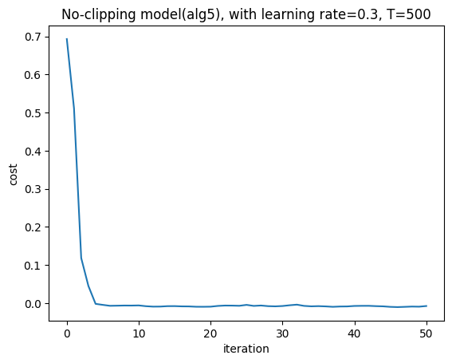
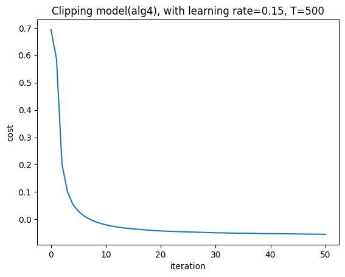

### Additional Results (Rebuttal Only)

## Learning Rate Tuning on MNIST

  
  

  <em>
  Left: Algorithm 5 (with barrier) remains stable at a larger step size (η = 0.3) and achieves faster convergence, reaching low loss within ~40 iterations.  
  Right: Algorithm 4 (no barrier) converges slowly at η = 0.15 (~100 iterations). For larger step sizes (η > 0.15), the optimization becomes unstable: weights and intermediate values grow rapidly, leading to numerical overflow in polynomial evaluations and resulting in NaN loss (divergence).
  </em>

